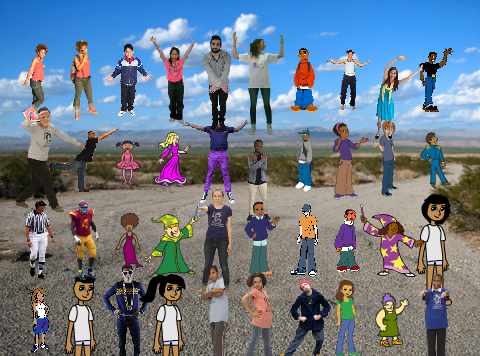
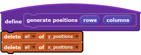
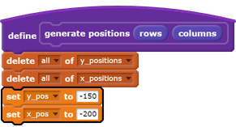
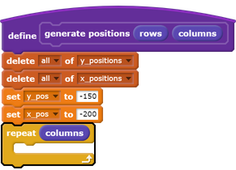
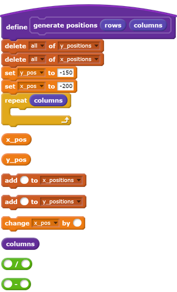
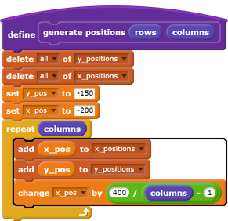

## Create a grid

You are going to create a grid of stamped costumes:

	
To do this you need to know the `x`{:class="blockmotion"} and `y`{:class="blockmotion"} coordinates of where each stamp should be placed.

--- task ---
First, create a new block called `generate positions`{:class="blockmoreblocks"}. The block needs to have two 'number input' parameters. Call the two parameters `rows`{:class="blockmoreblocks"} and `columns`{:class="blockmoreblocks"}.

The values of these parameters will decide how many rows and columns your grid has.

[[[generic-scratch-make-block]]]

--- /task ---

--- task ---
Create two lists, and call one of them `x_positions`{:class="blockdata"} and the other `y_positions`{:class="blockdata"}. These lists are for storing the `x`{:class="blockmotion"} and `y`{:class="blockmotion"} coordinates for the stamps.
--- /task ---

--- task ---
Inside your `generate positions`{:class="blockmoreblocks"} block, add blocks to delete all the items from both lists, so that each time the game starts, the lists are empty.

--- /task ---

--- task ---
Next, create two variables, and call one of them `x_pos`{:class="blockdata"} and the other `y_pos`{:class="blockdata"}.
--- /task ---

The `x_positions`{:class="blockdata"} list should contain ten numbers in total, and these should start at `-200`{:class="blockdata"} and go up to `200`{:class="blockdata"}.

For now, the `y_positions`{:class="blockdata"} list can just contain the number `-150`{:class="blockdata"} ten times, so that the grid only has one row.

--- task ---
Start by adding code to the `generate positions`{:class="blockmoreblocks"} block to set the `y_pos`{:class="blockdata"} variable to `-150`{:class="blockdata"} and the `x_pos`{:class="blockdata"} variable to `-200`{:class="blockdata"}. This is the location of the first stamped sprite.

--- /task ---

--- task ---
Next, add a `repeat`{:class="blockcontrol"} loop to put coordinates into the lists.

The `repeat`{:class="blockcontrol"} loop should run once for every column you want the grid to have.

The `generate positions`{:class="blockmoreblocks"} block takes `columns`{:class="blockmoreblocks"} as an input, so you can use `columns`{:class="blockmoreblocks"} for the `repeat`{:class="blockcontrol"} loop.

--- /task ---
	
Within the `repeat`{:class="blockcontrol"} loop, add the values of `x_pos`{:class="blockdata"} and `y_pos`{:class="blockdata"} into the lists. Then you need to increase the value of `x_pos`{:class="blockdata"} by a little. How much should the value of `x_pos`{:class="blockdata"} increase by?

This is how to figure it out:
  - `x_pos`{:class="blockdata"} starts out with the value `-200`{:class="blockdata"}
  - The final time the loop `repeat`{:class="blockcontrol"} runs, `x_pos`{:class="blockdata"} should reach the value `200`{:class="blockdata"}
  - That's a total increase of `400`{:class="blockdata"}
  - The first `x_pos`{:class="blockdata"} value is for the first column on the grid, and how many columns there are is determined by the `columns`{:class="blockmoreblocks"} input

So after the first `x_pos`{:class="blockdata"} value is added, each time around the loop, the value of `x_pos`{:class="blockdata"} should increase by `400 / (columns - 1)`{:class="blockoperators"}

--- task ---
Add in the code that will add all the `x_pos`{:class="blockdata"} and `y_pos`{:class="blockdata"} values into the `x_positions`{:class="blockdata"} and `y_positions`{:class="blockdata"} lists.
	
--- hints --- --- hint ---
Within the loop, you need to add `x_pos`{:class="blockdata"} to the `x_positions`{:class="blockdata"} list, and add the `y_pos`{:class="blockdata"} to the `y_positions`{:class="blockdata"} list.
Then `x_pos`{:class="blockdata"} variable needs to increase by `400 / (columns -1)`{:class="blockoperators"} each time the loop repeats.
--- /hint --- --- hint ---
This shows the additional blocks you need to add into your script.

--- /hint --- --- hint ---

- Here is the completed script for the `generate positions`{:class="blockmoreblocks"} block:

--- /hint --- --- /hints ---
--- /task ---
