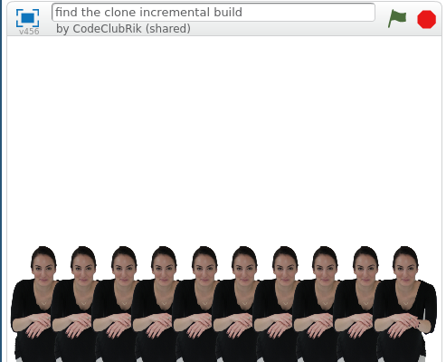

## Stamp a row

So far you have ten values in each of the two lists. Now stamp some costumes at the Stage coordinates stored in the lists.

--- task ---
Create a new block and call it `stamp sprites`{:class="blockmoreblocks"}. This block needs two number inputs named `row`{:class="blockmoreblocks"} and `columns`{:class="blockmoreblocks"} just like the other custom block.

```blocks
define stamp sprites (rows) (columns)
```
--- /task ---

--- task ---
Create a new variable called `index`{:class="blockdata"} with which to track the position in the lists that your program is reading. To begin with, set `index`{:class="blockdata"} to `1`{:class="blockdata"} to fetch the first item of each list.

```blocks
define stamp sprites (rows) (columns)
set [index v] to [1]
```
--- /task ---

--- task ---

The `stamp sprites`{:class="blockmoreblocks"} block should stamp a sprite for each pair of coordinates in the list. To do this, the block needs a `repeat`{:class="blockdata"} loop that runs once for each column.

```blocks
define stamp sprites (rows) (columns)
set [index v] to [1]
repeat (columns)
```
--- /task ---	

--- task ---
Within the `repeat`{:class="blockdata"} loop:
 - Move the sprite to the `index`{:class="blockdata"} position in the `x_positions`{:class="blockdata"} and `y_positions`{:class="blockdata"} lists
 - `Stamp`{:class="blockpen"} the sprite
 - Change the `index`{:class="blockdata"} by `1`{:class="blockdata"}

--- hints --- --- hint ---

Within the `repeat`{:class="blockdata"} loop, add a `go to x: y:`{:class="blockmotion"} block. The `x`{:class="blockmotion"} position in this block should be set to the `index`{:class="blockdata"} of `x_positions`{:class="blockdata"} and the `y`{:class="blockmotion"} position should be set to the `index`{:class="blockdata"} of `y_positions`{:class="blockdata"}. Then add code to `stamp`{:class="blockpen"} the sprite. Finally, add code to increase `index`{:class="blockdata"} by 1.

--- /hint --- --- hint ---
Here are the blocks you need:
```blocks
define stamp sprites (rows) (columns)
set [index v] to [1]
repeat (columns)
end

change [index v] by (1)
(index) 
(index) 
go to x: () y: ()
(item ()of [y_positions v])
(item ()of [x_positions v])
stamp
```
--- /hint --- --- hint ---
Here is the completed script for the `stamp sprites`{:class="blockmoreblocks"} block:
```blocks
define stamp sprites (rows) (columns)
set [index v] to [1]
repeat (columns)
go to x: (item (index) of [x_positions v]) y: (item (index) of [y_positions v]
stamp
change [index v] by (1)
```
--- /hint --- --- /hints ---
--- /task ---

--- task ---
Add a `clear`{:class="blockpen"} block below the `when flag clicked`{:class="blockcontrol"} block to clear the Stage each time the game starts. Then add the `stamp sprites`{:class="blockmoreblocks"} block at the bottom of the `when flag clicked`{:class="blockcontrol"} script so you can test your new code.

```blocks
when flag clicked
clear
generate positions (1) (10) ::custom
stamp sprite (1) (10) ::custom
```
--- /task ---	

--- task ---
Click the green flag. You should see something like this, depending on the costumes your sprite has:


--- /task ---

