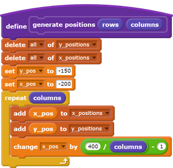
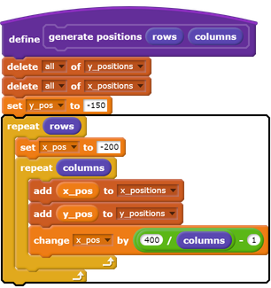
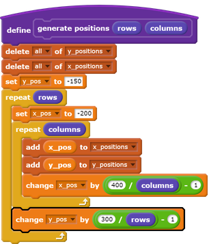
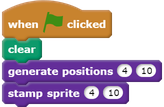
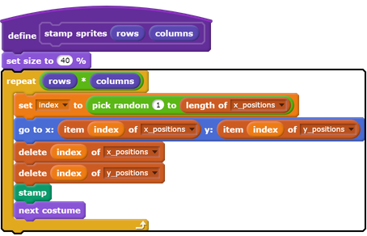

## Add rows

Now that you have the code to create a single row of stamped costumes, you should add code to create more rows.

Go to your `generate positions`{:class="blockmoreblocks"} block.

--- task ---
Add another `repeat`{:class="blockcontrol"} loop that runs the number of times you give to the `generate positions`{:class="blockmoreblocks"} block as the `rows`{:class="blockmoreblocks"} input. Place the `repeat`{:class="blockcontrol"} loop into your script as shown here:

--- /task ---

Next you need to increase the value of `y_pos`{:class="blockdata"} each time the `repeat (rows)`{:class="blockcontrol"} loop runs.

You do this in a similar manner to how you increase the value of `x_pos`{:class="blockdata"} in the `repeat (columns)`{:class="blockcontrol"} loop.

--- task ---
At the end of the code inside the `repeat (rows)`{:class="blockcontrol"} loop, `y_pos`{:class="blockdata"} should increase up to `150`{:class="blockdata"}, which is `300`{:class="blockdata"} away from its starting value of `-150`{:class="blockdata"}. This needs to happen for each row of stamps.

--- /task ---

--- task ---
Make sure you give the number of `rows`{:class="blockmoreblocks"} as an input to your blocks.

--- /task ---
	
--- task ---
Run your code now.

	
You won't get a neat grid of stamps.

This is because, right now, the `stamp sprite`{:class="blockmoreblocks"} block only runs for the total number of columns.
--- /task ---

--- task ---

Change your `stamp sprites`{:class="blockmoreblocks"} script so that it `repeats`{:class="blockcontrol"} enough times to stamp the complete grid of sprites.

--- hints --- --- hint ---
The total number of stamps you need is the number you give as `columns`{:class="blockmoreblocks"} multiplied by the number you give as `rows`{:class="blockmoreblocks"}
--- /hint --- --- hint ---
Use this additional block:

--- /hint --- --- hint ---
Here's the completed `stamp sprites`{:class="blockmoreblocks"} script:

--- /hint --- --- /hints ---

--- /task ---
